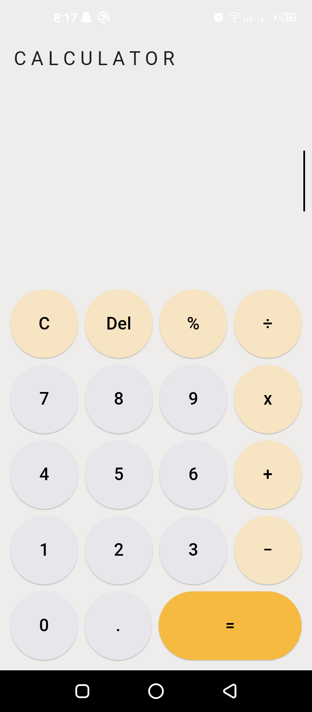

# Calculator App

A simple calculator app built using Flutter. Perform basic mathematical operations, including addition, subtraction, multiplication, division, and percentage calculations.

## Features

- **User-Friendly Interface:** Intuitive design for easy interaction.
- **Real-Time Calculation:** View calculations in real-time as you input numbers and operations.
- **Blinking Cursor:** Animated blinking cursor for a dynamic and engaging user experience.
- **Error Handling:** Handles parsing and evaluation errors gracefully, providing clear feedback.

## Screenshots



## Getting Started

### Prerequisites

Make sure you have Flutter and Dart installed on your local machine. Follow the official Flutter installation guide: [Flutter - Get Started](https://flutter.dev/docs/get-started/install)

### Running the App

1. Clone the repository:

   ```bash
   git clone https://github.com/amna-20/calculator
